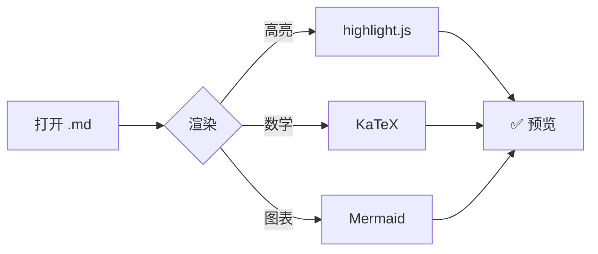

# MarkDesk 渲染特性展示

## 新增特性

### Emoji 表情 `:smile:`

欢迎使用 MarkDesk :rocket: !  现在支持短代码 emoji:

:wink: :+1: :heart: :fire: :tada: :rocket: :smile: :100:

常用：:white_check_mark: :x: :bulb: :warning: :info: :arrow_right: :link:

### 标题锚点

所有标题自动生成 `id`,可被页内链接跳转。例如上面这个 `### 标题锚点` 的 id 是 `标题锚点`(GitHub 风格 slug)。

→ 跳到 [GitHub Alerts](#github-alerts) 试试。

### 自定义容器 `:::name ... :::`

用三个冒号包裹的块,可加 class 名做提示框:

::: note
**提示**:这是一条 note 容器,蓝色左边框。
:::

::: tip
**技巧**:用 `::: tip` 突出实用建议。容器内的 **粗体**、`代码`、[链接](https://example.com) 都正常。
:::

::: warning
**注意**:warning 容器用于需要留意的项。
:::

::: danger
**危险**:danger 容器用于严重警告。
:::

::: success
**成功**:success 容器用于正面反馈。
:::

### GitHub Alerts

GitHub 2023 风格的提示块(`> [!TYPE]`):

> [!NOTE]
> Useful information that users should know, even when skimming content.

> [!TIP]
> Helpful advice for doing things better or more easily.

> [!IMPORTANT]
> Key information users need to know to achieve their goal.

> [!WARNING]
> Urgent info that needs immediate user attention to avoid problems.

> [!CAUTION]
> Advises about risks or negative outcomes of certain actions.

---

## 已有特性回顾

### GFM 表格

| 特性 | 语法 | 状态 |
|------|------|:----:|
| 表格 | `\|...\|` | ✅ |
| 任务列表 | `- [x]` | ✅ |
| 脚注 | `[^1]` | ✅ |
| 删除线 | `~~text~~` | ✅ |
| Emoji | `:smile:` | ✅ 新 |

### 任务列表

- [x] 渲染 Markdown 基础语法
- [x] 支持代码高亮 / 数学 / 图表
- [x] 新增 Emoji 与标题锚点
- [ ] 定义列表(Markdig 1.3.2 扩展缺陷,暂不支持)

### 脚注

这段文字有一个脚注[^1],另一处也有[^second]。

[^1]: 这是第一个脚注的内容。
[^second]: 这是第二个脚注,**支持行内格式**。

### 强调扩展

~~删除线~~、下标 H~2~O、上标 E=mc^2^、++插入文本++、==标记高亮==。

### 代码高亮

```csharp
public static void Main(string[] args)
{
    Console.WriteLine("Hello, MarkDesk! 👋");
}
```

```javascript
function greet(name) {
    return `Hello, ${name}! 🚀`;
}
```

### 数学公式

行内:$E = mc^2$ 与 $a^2 + b^2 = c^2$。

块级:

$$
\int_{-\infty}^{\infty} e^{-x^2} dx = \sqrt{\pi}
$$

### Mermaid 图表



---

## XSS 防护测试

下面这些不应被执行(应被禁用或转义):

- 原始 HTML:`<script>alert(1)</script>` → 应显示为文本
- 危险链接:[点我](javascript:alert(1)) → 点击应无效
- 危险链接:[点我](data:text/html,<script>alert(1)</script>) → 应被禁用
