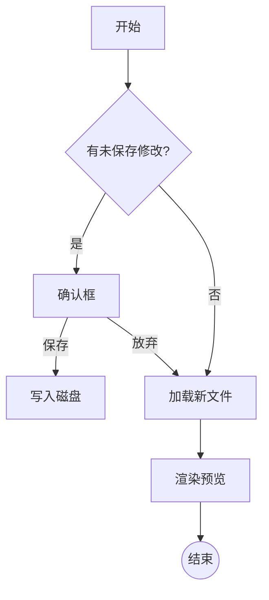
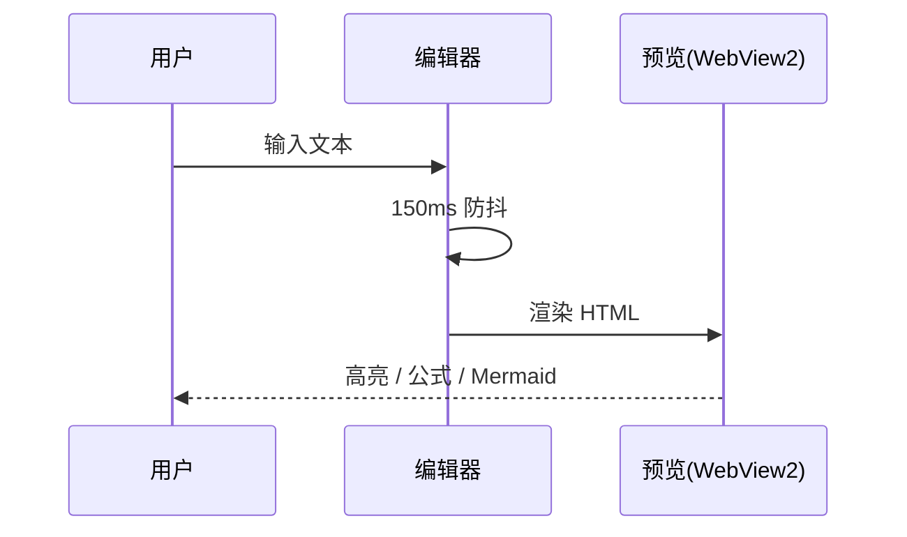
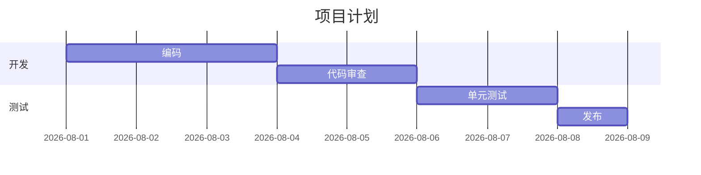
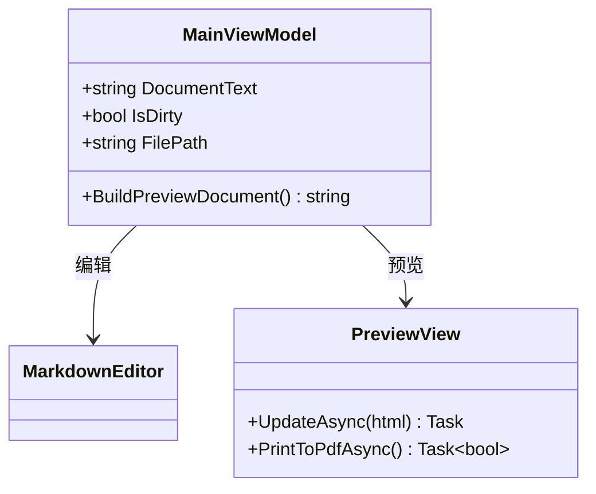
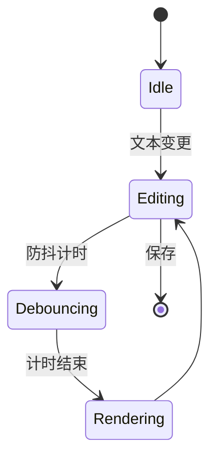
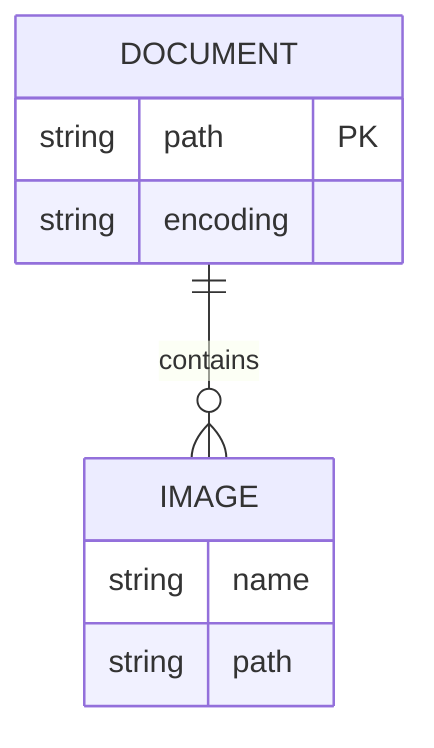
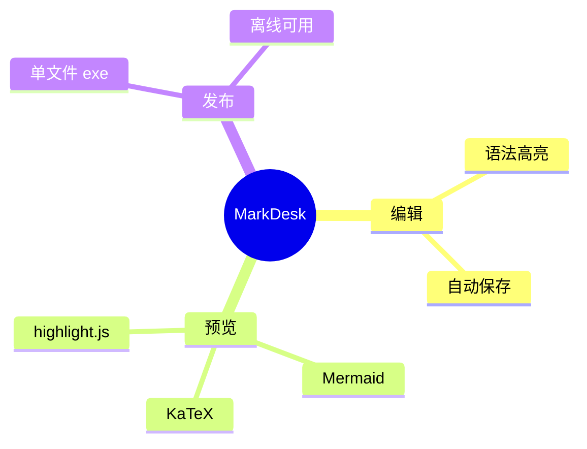

# MarkDesk 渲染测试

本文档用于验证 MarkDesk 的完整渲染能力:标题层级、段落、列表、表格、引用、任务列表、公式(KaTeX)、代码高亮(highlight.js)与 Mermaid 图,所有资源均为本地提供、离线可用。

## 基础排版

**加粗**、*斜体*、`行内代码`、~~删除线~~ 与 [链接](https://example.com)。

> 引用块:MarkDesk 是一个基于 WPF 的 Markdown 编辑器,支持实时预览与 PDF 导出。

- 无序列表项
- 嵌套
  - 二级项
  - 二级项
- 结尾项

1. 有序列表
2. 第二项
3. 第三项

- [x] 已完成任务
- [ ] 待办任务

## 表格

| 功能 | 状态 | 说明 |
| ---- | ---- | ---- |
| 编辑 / 预览 / 分栏 | ✅ | FR-09 三模式布局 |
| PDF 导出 | ✅ | A4 / Letter |
| 外部变更检测 | ✅ | 去抖合并提示 |

## 数学公式

行内公式 $E=mc^2$ 与 $a^2+b^2=c^2$,以及块级公式:

$$\int_0^1 x^2 \, dx = \frac{1}{3} \qquad \sum_{n=1}^{\infty} \frac{1}{n^2} = \frac{\pi^2}{6}$$

## 代码高亮

```csharp
public static int Fib(int n) =>
    n <= 1 ? n : Fib(n - 1) + Fib(n - 2);
```

```python
def fib(n: int) -> int:
    return n if n <= 1 else fib(n - 1) + fib(n - 2)
```

## Mermaid 图

### 流程图



### 时序图



### 甘特图



### 类图



### 状态图



### 实体关系图



### 思维导图



---

*若以上图表均正常渲染,说明 MarkDesk 本地渲染管线完整可用。*
