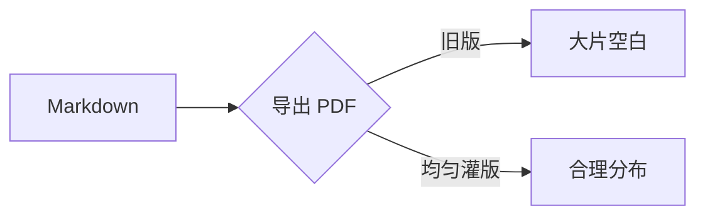

# PDF 分页压力测试

此文档用于验证 PDF 导出的"均匀灌版"效果:长代码块与长表格应**在页内合理断开**而不是整体搬到新页留下大片空白;小元素(alert、短引用、公式)保持不被切断。

## 一、长代码块(应跨页拆分,不整体跳页)

```csharp
// This block is intentionally long: it must SPLIT across the page boundary
// instead of being pushed to the next page as a whole.
using System;

namespace Pagination.Stress;

public class Demo
{
    public static void Run()
    {
        for (int i = 0; i < 100; i++)
        {
            Console.WriteLine($"iteration {i}: the quick brown fox jumps over the lazy dog");
            if (i % 10 == 0)
                Console.WriteLine("checkpoint reached, still going strong");
        }
    }
}
```

段落一。Lorem ipsum dolor sit amet, consectetur adipiscing elit. Sed do eiusmod tempor incididunt ut labore et dolore magna aliqua. Ut enim ad minim veniam, quis nostrud exercitation ullamco laboris nisi ut aliquip ex ea commodo consequat.

段落二。Duis aute irure dolor in reprehenderit in voluptate velit esse cillum dolore eu fugiat nulla pariatur. Excepteur sint occaecat cupidatat non proident.

> [!NOTE]
> 这是一个小的 alert 块——它足够矮,应当永远保持完整,不被从中间切开。

段落三。Sunt in culpa qui officia deserunt mollit anim id est laborum. Sed ut perspiciatis unde omnis iste natus error sit voluptatem.

## 二、长表格(应按行断开,表头逐页重复)

| 编号 | 名称 | 数量 | 说明 |
|-----:|------|-----:|------|
| 1 | alpha | 10 | 第一行数据 |
| 2 | beta | 20 | 第二行数据 |
| 3 | gamma | 30 | 第三行数据 |
| 4 | delta | 40 | 第四行数据 |
| 5 | epsilon | 50 | 第五行数据 |
| 6 | zeta | 60 | 第六行数据 |
| 7 | eta | 70 | 第七行数据 |
| 8 | theta | 80 | 第八行数据 |
| 9 | iota | 90 | 第九行数据 |
| 10 | kappa | 100 | 第十行数据 |
| 11 | lambda | 110 | 第十一行数据 |
| 12 | mu | 120 | 第十二行数据 |
| 13 | nu | 130 | 第十三行数据 |
| 14 | xi | 140 | 第十四行数据 |
| 15 | omicron | 150 | 第十五行数据 |
| 16 | pi | 160 | 第十六行数据 |
| 17 | rho | 170 | 第十七行数据 |
| 18 | sigma | 180 | 第十八行数据 |
| 19 | tau | 190 | 第十九行数据 |
| 20 | upsilon | 200 | 第二十行数据 |
| 21 | phi | 210 | 第二十一行数据 |
| 22 | chi | 220 | 第二十二行数据 |
| 23 | psi | 230 | 第二十三行数据 |
| 24 | omega | 240 | 第二十四行数据 |

## 三、公式与图(小元素保持完整)

行内公式 $E = mc^2$ 与展示公式:

$$\int_{-\infty}^{\infty} e^{-x^2} \, dx = \sqrt{\pi}$$



## 四、连续段落(孤行/寡行控制)

每段至少三行,验证 orphans/widows:被切页的段落在两页各保留至少三行。

段落四。Lorem ipsum dolor sit amet, consectetur adipiscing elit, sed do eiusmod tempor incididunt ut labore et dolore magna aliqua. Ut enim ad minim veniam, quis nostrud exercitation ullamco laboris nisi ut aliquip ex ea commodo consequat. Duis aute irure dolor in reprehenderit in voluptate velit esse cillum dolore eu fugiat nulla pariatur.

段落五。Excepteur sint occaecat cupidatat non proident, sunt in culpa qui officia deserunt mollit anim id est laborum. Sed ut perspiciatis unde omnis iste natus error sit voluptatem accusantium doloremque laudantium.

> 短引用块:同样应当保持完整,不被切断。

## 五、再一个长代码块(检验第二次拆分)

```python
# Another intentionally long block crossing a page boundary.
def fibonacci(n):
    a, b = 0, 1
    result = []
    for _ in range(n):
        result.append(a)
        a, b = b, a + b
    return result

if __name__ == "__main__":
    for value in fibonacci(50):
        print(value)
```

段落六。Nemo enim ipsam voluptatem quia voluptas sit aspernatur aut odit aut fugit, sed quia consequuntur magni dolores eos qui ratione voluptatem sequi nesciunt.

段落七。Neque porro quisquam est, qui dolorem ipsum quia dolor sit amet, consectetur, adipisci velit, sed quia non numquam eius modi tempora incidunt ut labore et dolore magnam aliquam quaerat voluptatem.
