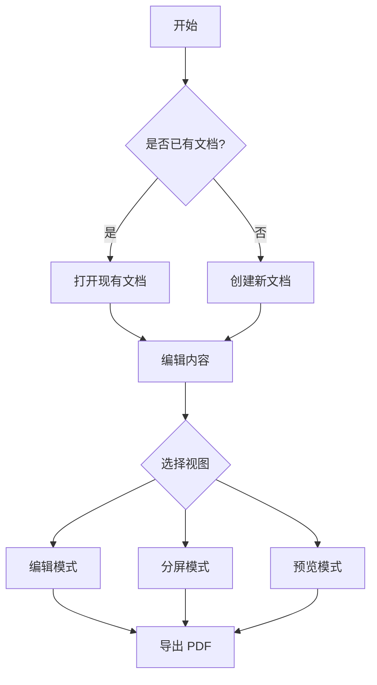
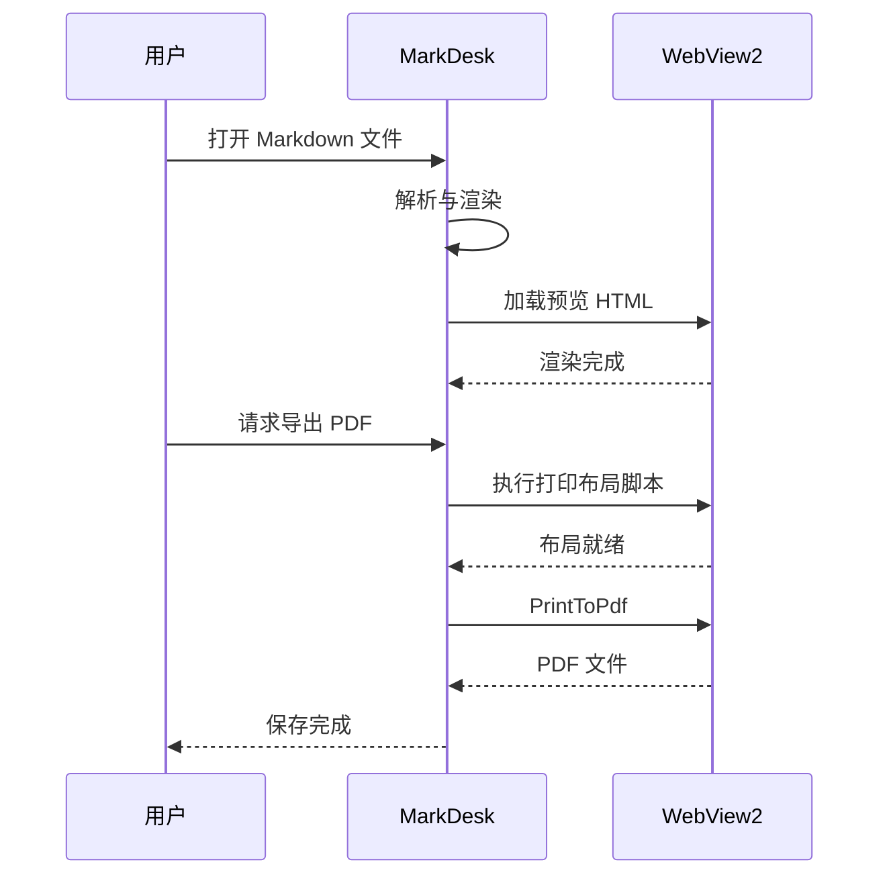
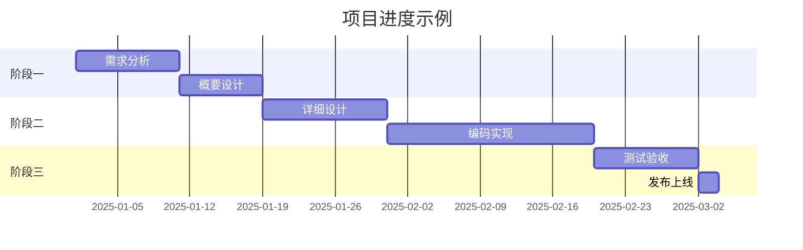

# 媒体与公式压力测试

本文件验证 PDF 导出对图片(不同宽高比)、Mermaid 图表(多类型)、KaTeX 公式(行内/展示/长公式)的排版与分页处理。

## 一、图片

### 小图(240×160,应内联于文字流)


此图较小,应当跟随文字排版,不需要单独占页。

### 高图(400×1200,应受 23cm 高度约束缩放)


超高图片必须被缩放到一页之内,不允许溢出到页面外。

### 宽图(1600×300,应按页宽缩放)


超宽图片按内容宽度缩放,不允许被裁剪。

## 二、Mermaid 图表(每张图必须保持完整,不得切断)

### 流程图



### 时序图



### 甘特图



## 三、数学公式

### 行内公式

质能方程 $E = mc^2$、欧拉公式 $e^{i\pi} + 1 = 0$、黄金比例 $\varphi = \frac{1+\sqrt{5}}{2}$ 都应与文字基线对齐。

### 展示公式

$$\oint_{\partial \Omega} \mathbf{F} \cdot d\mathbf{r} = \iint_{\Omega} (\nabla \times \mathbf{F}) \cdot d\mathbf{A}$$

### 超长公式(不允许切断,允许横向缩排)

$$\sum_{n=1}^{\infty} \frac{1}{n^2} = \frac{\pi^2}{6} \qquad \prod_{p \in \mathbb{P}} \frac{1}{1 - p^{-2}} = \frac{\pi^2}{6} \qquad \int_{-\infty}^{\infty} e^{-x^2}\,dx = \sqrt{\pi} \qquad \lim_{n \to \infty} \left(1 + \frac{1}{n}\right)^n = e$$

### 公式组

$$\begin{aligned} \nabla \cdot \mathbf{E} &= \frac{\rho}{\varepsilon_0} \\ \nabla \cdot \mathbf{B} &= 0 \\ \nabla \times \mathbf{E} &= -\frac{\partial \mathbf{B}}{\partial t} \\ \nabla \times \mathbf{B} &= \mu_0 \mathbf{J} + \mu_0 \varepsilon_0 \frac{\partial \mathbf{E}}{\partial t} \end{aligned}$$

## 四、图文混排与分页混合场景

以下把公式、图、代码交错排列,验证复杂混合内容的分页质量。

$$\hat{y} = \sigma(W_l \cdot \sigma(W_{l-1} \cdot \ldots \sigma(W_1 x + b_1) \ldots + b_{l-1}) + b_l)$$


```text
神经网络:输入层 -> 隐藏层(可多层)-> 输出层
激活函数:Sigmoid / ReLU / GELU / Tanh
训练方法:反向传播 + 梯度下降(SGD、Adam、AdamW)
```

$$P(A \mid B) = \frac{P(B \mid A)\,P(A)}{P(B)}$$

贝叶斯定理如上。连续的公式与文字交替,每 个 公 式 块 都 是 原 子 单 元,不应被切断;文字部分正常按孤行规则分页。


最后一段文字:本文档的所有媒体元素(图 ×5、Mermaid ×3、公式 ×7)在导出 PDF 后,均应完整呈现在各自页面内,不出现裁剪、溢出或空白异常。
